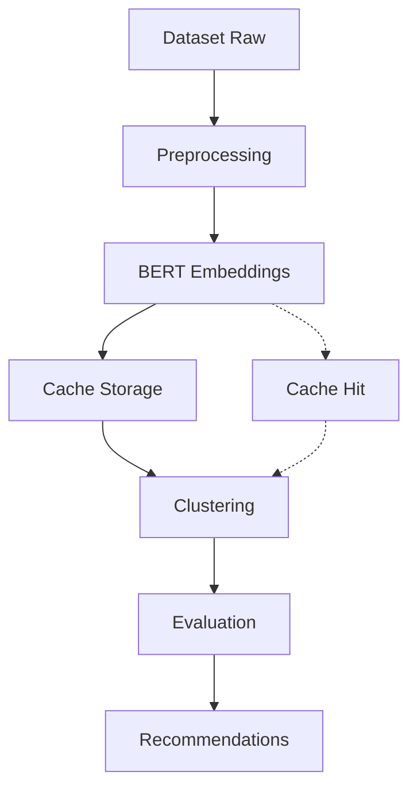

# 🏗️ Arquitectura Técnica - Clustering Semántico de Letras

## 📋 Visión General

La arquitectura del módulo de clustering semántico está diseñada siguiendo principios de:
- **Modularidad**: Componentes independientes y reutilizables
- **Escalabilidad**: Capaz de manejar datasets grandes (16K+ canciones)
- **Robustez**: Tolerante a fallos con recuperación automática
- **Performance**: Optimizado para CPU sin compromiso en calidad

## 🎯 Componentes Principales

### 1. **Módulo Config** 📋
**Propósito**: Configuración centralizada del sistema

```
config/
├── bert_models.py          # Configuración modelos BERT
├── clustering_params.py    # Parámetros clustering
├── evaluation_settings.py  # Configuración métricas
└── data_paths.py          # Rutas datos y cache
```

**Responsabilidades**:
- Gestión configuraciones BERT multilingües
- Parámetros optimizados por algoritmo clustering
- Rutas centralizadas datos y cache
- Optimizaciones específicas CPU

### 2. **Módulo Preprocessing** 🔧
**Propósito**: Limpieza y normalización texto musical multilingüe

```
preprocessing/
├── text_cleaner.py        # Limpieza universal música
├── language_detector.py   # Detección idiomas
├── normalizer.py          # Normalización Unicode
├── feature_extractor.py   # Extracción características
└── stopwords_manager.py   # Gestión stopwords
```

**Pipeline de Procesamiento**:
1. **Limpieza estructural**: Remoción metadatos musicales
2. **Normalización Unicode**: Consistencia caracteres especiales
3. **Expansión contracciones**: Por idioma específico
4. **Manejo repeticiones**: Smart repetition handling
5. **Optimización BERT**: Longitud y tokenización

### 3. **Módulo Vectorization** 🧠
**Propósito**: Embeddings BERT + sistema cache inteligente

```
vectorization/
├── bert_embedder.py       # BERT embeddings CPU-optimized
├── cache_manager.py       # Cache multi-nivel
├── similarity_calculator.py # Similitudes semánticas
└── batch_processor.py     # Procesamiento batch
```

**Arquitectura Cache Multi-Nivel**:
- **L1 (Memory)**: LRU cache 2000 vectores, acceso 1ms
- **L2 (Disk)**: Cache comprimido 3GB, acceso 50ms
- **L3 (Database)**: SQLite metadata indexada, acceso 10ms

**Optimizaciones CPU**:
- Batch processing adaptativos (64 canciones/batch)
- Paralelización multi-core automática
- Memory management entre batches
- Progress tracking detallado

### 4. **Módulo Clustering** 🎯
**Propósito**: Algoritmos clustering semántico especializado

```
clustering/
├── hopkins_semantic.py    # Hopkins test vectores BERT
├── cluster_optimizer.py   # Optimización K multi-método
├── semantic_clusterer.py  # Clustering unificado
└── hierarchical_analyzer.py # Análisis jerárquico
```

**Algoritmos Implementados**:
1. **K-Means Cosine**: Clustering base, rápido, balanced
2. **Hierarchical Ward**: Análisis jerárquico interpretable
3. **HDBSCAN**: Detección automática clusters densos

**Optimización K**:
- Elbow Method + Silhouette + Gap Statistic
- Custom Semantic Coherence métrica
- Validación cross-lingual consistency

### 5. **Módulo Evaluation** 📊
**Propósito**: Métricas evaluación especializadas letras

```
evaluation/
├── semantic_metrics.py      # Métricas core coherencia
├── multilingual_validator.py # Validación cross-lingual
├── benchmark_comparator.py  # Comparación baselines
└── topic_analyzer.py       # Análisis temas LDA
```

**Métricas Implementadas**:
- **Topic Coherence**: Coherencia temática LDA
- **Semantic Diversity**: Balance intra/inter-cluster
- **Cross-lingual Consistency**: Validación multilingüe
- **Musical Relevance**: Métricas específicas dominio

### 6. **Módulo Recommendation** 🎵
**Propósito**: Sistema recomendación semántica ultra-rápido

```
recommendation/
├── lyrics_recommender.py   # Motor recomendación principal
├── semantic_search.py     # Búsqueda semántica FAISS
├── similarity_ranker.py    # Ranking multi-factor
└── hybrid_fusion.py       # Preparación fusión musical
```

**Estrategias Recomendación**:
1. **Cluster-Based**: Dentro mismo cluster semántico
2. **Similarity-Based**: Top-K cosine similarity
3. **Hybrid Approach**: Cluster + similarity weighted
4. **Diversity-Boosted**: Anti-redundancia automática

## 🔄 Flujo de Datos

### **Pipeline Principal**


### **Procesamiento Detallado**
1. **Input**: CSV con letras y metadata
2. **Preprocessing**: Limpieza multilingüe + normalización
3. **Vectorización**: BERT embeddings 384D + L2 normalization
4. **Cache**: Storage inteligente + content hashing
5. **Clustering**: Hopkins test + K optimization + algoritmos
6. **Evaluation**: Métricas calidad + benchmarking
7. **Output**: Clusters + recomendaciones + análisis

## ⚡ Optimizaciones Performance

### **CPU-First Strategy**
- **Threading**: Paralelización automática todos cores CPU
- **Batching**: Batches grandes (64) para eficiencia CPU
- **Memory**: Gestión memoria automática + garbage collection
- **Caching**: Evita re-cálculos costosos BERT

### **Cache Intelligence**
- **Content-based hashing**: Invalidación automática cambios
- **Multi-level hierarchy**: RAM → Disk → Database
- **Compression**: LZ4 para balance speed/size
- **Background maintenance**: Cleanup automático

### **Error Resilience**
- **Error classification**: Automática por tipo
- **Recovery strategies**: Específicas por error
- **Fallback processing**: Individual si batch falla
- **Monitoring**: Real-time error tracking

## 🔧 Interfaces y APIs

### **Interface Principal**
```python
from clustering.algorithms.lyrics import LyricsClusteringSystem

# Inicialización
system = LyricsClusteringSystem(config="optimal_cpu")

# Pipeline completo
results = system.run_full_pipeline(
    dataset_path="data/picked_data_optimal.csv"
)

# Recomendaciones
recommendations = system.recommend_similar(
    song_id="track_123",
    n_recommendations=10,
    strategy="hybrid"
)
```

### **Interface Modular**
```python
# Uso modular específico
from clustering.algorithms.lyrics.vectorization import BERTEmbedder
from clustering.algorithms.lyrics.clustering import SemanticClusterer

embedder = BERTEmbedder(model="multilingual-minilm")
clusterer = SemanticClusterer(algorithm="kmeans_cosine")

vectors = embedder.embed_texts(lyrics_list)
clusters = clusterer.fit_predict(vectors)
```

## 📊 Monitoreo y Logging

### **Sistema Logging Multi-Nivel**
- **DEBUG**: Procesamiento BERT detallado
- **INFO**: Progreso clustering y métricas
- **WARNING**: Alertas multilingües y performance
- **ERROR**: Errores críticos con stack trace

### **Performance Monitoring**
- **Throughput**: Canciones/segundo en tiempo real
- **Memory**: Usage tracking con alertas
- **Cache**: Hit rates y efficiency metrics
- **Quality**: Métricas clustering continuous

### **Error Tracking**
- **Pattern analysis**: Identificación patrones errores
- **Recovery metrics**: Success rate recuperación
- **System health**: Estado general sistema
- **Recommendations**: Optimizaciones sugeridas

## 🔮 Extensibilidad

### **Puntos de Extensión**
1. **Nuevos modelos BERT**: Interface modular embedders
2. **Algoritmos clustering**: Plugin architecture
3. **Métricas custom**: Extension framework evaluation
4. **Estrategias recomendación**: Pluggable recommenders

### **Integration Hooks**
- **Musical clustering**: Interface preparada fusión
- **User feedback**: Hooks para learning personalizado
- **A/B testing**: Framework experimentación ready
- **Real-time updates**: Streaming processing preparado

---

**Nota**: Esta arquitectura está diseñada para ser robusta, escalable y mantenible, siguiendo mejores prácticas de software engineering aplicadas a sistemas de machine learning para Music Information Retrieval.