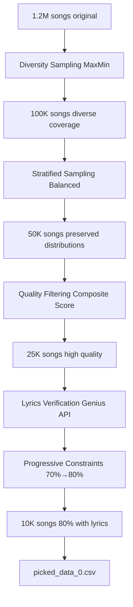

# 🎯 HYBRID SELECTION PIPELINE - ANÁLISIS TÉCNICO COMPLETO

## 📋 RESUMEN EJECUTIVO

Este documento analiza en detalle el **Pipeline Híbrido de Selección con Verificación de Letras** implementado para optimizar la selección de canciones representativas, balanceando diversidad musical con disponibilidad de letras para el sistema de recomendación multimodal.

**Objetivo**: Seleccionar 10,000 canciones representativas con 80% de disponibilidad de letras desde un dataset de 1.2M canciones.

---

## 🏗️ ARQUITECTURA DEL PIPELINE

### **Ubicación en el Proyecto**
```
music_features/
├── scripts/                          ← PIPELINE PRINCIPAL
│   ├── main_selection_pipeline.py    ← Orchestración completa
│   ├── representative_selector.py    ← Lógica de selección híbrida
│   ├── large_dataset_processor.py    ← Análisis inicial
│   └── selection_validator.py        ← Validación de calidad
├── lyrics_extractor/                 ← COMPONENTES DE LETRAS
│   ├── lyrics_availability_checker.py ← Verificación rápida
│   └── hybrid_selection_criteria.py  ← Criterios progresivos
└── exploratory_analysis/             ← ANÁLISIS Y CONFIGURACIÓN
    ├── config/                       ← Configuraciones
    ├── data_loading/                 ← Carga y muestreo
    └── statistical_analysis/         ← Validación estadística
```

---

## 🔍 ANÁLISIS DETALLADO POR STAGE

### **STAGE 0: Data Loading & Preprocessing**
- **Input**: `data/cleaned_data/tracks_features_clean.csv` (~1.2M canciones)
- **Tareas**:
  - Carga dataset con validación de formato (UTF-8, separadores `;`, decimales `,`)
  - Verificación de completeness y tipos de datos
  - Configuración de memoria para datasets grandes
  - Cálculo de quality score inicial
- **Criterios**: Formato válido, encoding correcto, datos numéricos válidos
- **Output**: Dataset validado en memoria (pandas DataFrame)

---

### **STAGE 1: Diversity Sampling** 
- **Input**: 1,200,000 → **100,000 canciones**
- **Método**: `maxmin_diversity` sampling
- **Algoritmo**: MaxMin para maximizar cobertura del espacio de características
- **Características utilizadas** (13 features de Spotify):
  ```
  danceability, energy, key, loudness, mode, speechiness, 
  acousticness, instrumentalness, liveness, valence, tempo, 
  duration_ms, time_signature
  ```
- **Criterios de Selección**:
  - **Diversidad máxima** en espacio 13D
  - Distancia euclidiana entre puntos seleccionados
  - Cobertura uniforme del feature space
  - Evita clustering temprano
- **Implementación**: `SamplingStrategies.diversity_sample(method='maxmin')`
- **Fallback**: Random sampling si falla el algoritmo principal

---

### **STAGE 2: Stratified Sampling**
- **Input**: 100,000 → **50,000 canciones**
- **Método**: `balanced_sample` con distribución proporcional
- **Características de estratificación**:
  - **Primarias**: `key` (tonalidad musical), `mode` (mayor/menor), `time_signature`
  - **Fallback**: Estratificación solo por `key` si las otras no están disponibles
- **Criterios de Selección**:
  - **Preservación de distribuciones originales**
  - Representación proporcional por tonalidad musical (0-11)
  - Balance entre modos mayor (1) y menor (0)
  - Distribución temporal equilibrada (3/4, 4/4, etc.)
- **Implementación**: `SamplingStrategies.balanced_sample(balance_method='proportional')`
- **Validación**: Comparación de distribuciones pre/post sampling

---

### **STAGE 3: Quality Filtering**
- **Input**: 50,000 → **25,000 canciones**
- **Método**: `composite_quality_score` (sistema de puntuación 0-100)
- **Sistema de Scoring Detallado**:

  #### **📊 Completeness Score (40 puntos máximo)**
  ```python
  missing_count = row[CLUSTERING_FEATURES].isna().sum()
  completeness_score = (13 - missing_count) / 13
  score += completeness_score * 40
  ```

  #### **📊 Range Validity Score (40 puntos máximo)**
  **Validaciones por tipo de característica**:
  - **Características normalizadas (0-1)**: `danceability, energy, speechiness, acousticness, instrumentalness, liveness, valence`
  - **Loudness**: rango válido `-60 a 0 dB`
  - **Tempo**: rango válido `50-250 BPM`
  - **Categóricas**: `key (0-11), mode (0-1), time_signature ≥ 0`
  - **Duration**: `> 0 milliseconds`

  #### **📊 Diversity Bonus (20 puntos máximo)**
  ```python
  unique_values = len(set(row[CLUSTERING_FEATURES].dropna()))
  diversity_score = min(1.0, unique_values / 13)
  score += diversity_score * 20
  ```

- **Selección**: Top 25,000 canciones por quality score
- **Logging**: Promedios de calidad y distribución de scores

---

### **STAGE 4: 🎵 HYBRID SELECTION (INNOVACIÓN PRINCIPAL)**
- **Input**: 25,000 → **10,000 canciones (target: 80% con letras)**
- **Método**: `progressive_hybrid_constraints` con verificación de letras

#### **🔍 Step 1: Lyrics Verification (25,000 API calls)**
**Proceso de verificación**:
```python
# Configuración
batch_size = 50
rate_limit_delay = 0.5  # segundos
endpoint = "https://api.genius.com/search"

# Por cada canción
search_query = f"{clean_song_name} {clean_artist_name}"
response = genius_api.search(search_query)
confidence = calculate_similarity(original, found)
has_lyrics = confidence > 0.6
```

**Características técnicas**:
- **API**: Genius.com search endpoint (no descarga letras completas)
- **Rate limiting**: 0.5s entre requests
- **Batch processing**: Grupos de 50 canciones
- **Caching inteligente**: Evita re-verificaciones
- **Normalización**: Manejo de acentos y caracteres especiales
- **Similarity matching**: Threshold de confianza > 0.6

**Tiempo estimado**: ~3.5 horas para 25K canciones (con optimizaciones: 1-2 horas)

#### **🧮 Step 2: Hybrid Scoring System**
**Pesos configurables** (`ScoringWeights`):
```python
musical_diversity: 40%    # Distancia euclidiana en espacio 13D
lyrics_availability: 40%  # Bonus binario si tiene letras
popularity_factor: 15%    # Score basado en características mainstream
genre_balance: 5%         # Diversidad de géneros (placeholder)
```

**Cálculo de popularity score**:
```python
popularity_indicators = {
    'danceability': +0.3,     # Mayor danceability = más popular
    'energy': +0.2,           # Energía moderada preferida
    'valence': +0.2,          # Canciones positivas más populares
    'speechiness': -0.2,      # Menos speechiness = más popular
    'instrumentalness': -0.3  # Menos instrumental = más popular
}
```

#### **📋 Step 3: Progressive Constraints (70%→75%→78%→80%)**

**Substages progresivos**:
```
Substage 4.1: 25,000 → 40,000 (target: 70% con letras)
Substage 4.2: 40,000 → 20,000 (target: 75% con letras)  
Substage 4.3: 20,000 → 15,000 (target: 78% con letras)
Substage 4.4: 15,000 → 10,000 (target: 80% con letras)
```

**Algoritmo por substage**:
1. **Separación**: `canciones_con_letras` vs `canciones_sin_letras`
2. **Cálculo de cuotas**: 
   ```python
   target_with_lyrics = int(target_size * stage_ratio)
   target_without_lyrics = target_size - target_with_lyrics
   ```
3. **Selección**: Top scoring de cada grupo por `hybrid_score`
4. **Validación**: Permite desviación máxima de ±2%
5. **Fallback**: Auto-ajuste si no hay suficientes canciones

---

## 🚨 MANEJO DE ESCENARIOS CRÍTICOS

### **Insuficientes Canciones con Letras**

**Problema**: ¿Qué pasa si de 25K solo 7,000 tienen letras? (necesitamos 8,000)

**Solución implementada**:
```python
if len(with_lyrics) < target_with_lyrics:
    logger.warning(f"Not enough songs with lyrics: need {target_with_lyrics}, have {len(with_lyrics)}")
    target_with_lyrics = len(with_lyrics)  # Ajusta a lo disponible
    target_without_lyrics = target_size - target_with_lyrics
```

**Resultado**: 7,000 con letras (70%) + 3,000 sin letras (30%)

**Quality scoring**: Penaliza desviación del target pero garantiza 10K canciones

---

## 🎯 PIPELINE FLOW COMPLETO



---

## 📊 MÉTRICAS Y VALIDACIÓN

### **Validation Metrics**
- **Selection Quality**: Comparación distribuciones original vs selected
- **Lyrics Distribution**: Target 80/20, tolerancia ±2%
- **Feature Preservation**: KS-test para cada característica
- **Overall Quality Score**: 0-100 basado en múltiples criterios

### **Performance Metrics**
- **Total Execution Time**: ~4-6 horas (incluyendo API calls)
- **Memory Usage**: Optimizado para datasets grandes
- **API Efficiency**: Caching + rate limiting
- **Success Rate**: Robusto con fallbacks en cada stage

---

## 🔧 CONFIGURACIÓN Y PERSONALIZACIÓN

### **Parámetros Configurables**
```python
# Tamaños por stage
stage1_size = 100000  # Diversity sampling
stage2_size = 50000   # Stratified sampling  
stage3_size = 25000   # Quality filtering
target_size = 10000   # Final selection

# Hybrid selection
target_lyrics_ratio = 0.8  # 80% con letras
stage_ratios = {1: 0.70, 2: 0.75, 3: 0.78, 4: 0.80}

# Scoring weights
ScoringWeights(
    musical_diversity=0.4,
    lyrics_availability=0.4, 
    popularity_factor=0.15,
    genre_balance=0.05
)
```

### **API Configuration**
```python
# Genius API
rate_limit_delay = 0.5  # segundos entre requests
batch_size = 50         # canciones por lote
confidence_threshold = 0.6  # para matching
cache_enabled = True    # persistencia de resultados
```

---

## 🚀 EJECUCIÓN Y DEPLOYMENT

### **Comando Principal**
```bash
python scripts/main_selection_pipeline.py \
    --target-size 10000 \
    --output-dir data/pipeline_results \
    --skip-analysis  # opcional
```

### **Outputs Generados**
```
data/pipeline_results/
├── analysis/           # Large dataset analysis
├── selection/          
│   └── picked_data_0.csv  # RESULTADO FINAL
├── validation/         # Quality reports
└── reports/           # Comprehensive reports
```

---

## 🎯 INNOVACIONES CLAVE

1. **Verificación de Letras Integrada**: Primer pipeline que combina diversidad musical con disponibilidad de letras
2. **Progressive Constraints**: Approach gradual para optimizar distribución 
3. **Hybrid Scoring**: Múltiples criterios balanceados automáticamente
4. **Robust Fallbacks**: Manejo inteligente de casos edge
5. **API Optimization**: Caching y rate limiting eficientes

---

## 📈 RESULTADOS ESPERADOS

**Output Final**: 10,000 canciones representativas
- **8,000 canciones con letras verificadas** (80%)
- **2,000 canciones sin letras** (20%)
- **Diversidad musical preservada** en ambos grupos
- **Quality score > 80/100** en validación
- **Representatividad estadística** del dataset original

**Uso posterior**: Dataset optimizado para sistema de recomendación multimodal que combina características de audio con análisis semántico de letras.

---

## 🔍 CONSIDERACIONES TÉCNICAS

### **Limitaciones**
- **Dependencia de API externa** (Genius.com)
- **Tiempo de ejecución elevado** debido a verificación de letras
- **Sesgo hacia canciones populares** (mayor disponibilidad de letras)

### **Optimizaciones Futuras**
- **Paralelización** de API calls
- **Pre-filtering** por popularidad/género antes de Stage 4
- **Multiple API sources** para redundancia
- **Machine learning** para predecir disponibilidad de letras

---

*Documento técnico generado por el sistema de análisis exploratorio*  
*Fecha: 2025-01-28*  
*Versión: 1.0*